# Week 04 UML Class Diagram - Instructions

## 🌐 Website to Generate the Diagram

### **Option 1: PlantUML Online Editor (EASIEST & RECOMMENDED)**

**Website:** https://www.plantuml.com/plantuml/uml/

**Steps:**
1. Open the website in your browser
2. You'll see a text editor on the left and preview on the right
3. **Delete** all existing code in the editor
4. **Copy** the entire contents of `UML_DIAGRAM.puml` file
5. **Paste** into the editor
6. The diagram will **render automatically** on the right!
7. **Download** your diagram:
   - Click "PNG" link at top to download as image
   - Click "SVG" for scalable vector graphics
   - Click "PDF" for document format

### **Option 2: PlantText (Alternative)**

**Website:** https://www.planttext.com/

**Steps:**
1. Open the website
2. Paste the PlantUML code
3. Click "Refresh" button
4. Download using the links provided

### **Option 3: PlantUML QEditor**

**Website:** https://plantuml-editor.kkeisuke.com/

**Steps:**
1. Open the website
2. Paste the code in the editor
3. Preview appears automatically
4. Export using download button

---

## 📋 PlantUML Code

The code is in the file: **`UML_DIAGRAM.puml`**

You can also copy it directly:

```plantuml
@startuml Week04_CafePOS_Complete

title Week 04 - Café POS System\nObserver Pattern + Strategy Pattern Implementation

[PASTE THE ENTIRE CONTENTS OF UML_DIAGRAM.puml HERE]

@enduml
```



---

## 🎨 What the Diagram Shows

### **1. Observer Pattern Package (Blue)**
- **OrderObserver** interface
- **OrderPublisher** interface
- **KitchenDisplay** - Observes "itemAdded" and "paid" events
- **DeliveryDesk** - Observes "ready" events
- **CustomerNotifier** - Observes all events

### **2. Payment Strategy Pattern Package (Orange)**
- **PaymentStrategy** interface
- **CashPayment** - Simple cash payment
- **CardPayment** - Card validation and masking
- **WalletPayment** - Wallet ID validation

### **3. Core Domain Package (Green)**
- **Order** - Central aggregate (implements OrderPublisher)
- **LineItem** - Order line items
- **Money** - Value object for amounts
- **OrderIds** - ID generator utility

### **4. Product Catalog Package (Purple)**
- **Product** interface
- **SimpleProduct** - Basic product implementation
- **Catalog** interface
- **InMemoryCatalog** - In-memory storage

### **5. Demo & Tests Package (Pink)**
- **Week4Demo** - Demonstration application
- **ObserverPatternTest** - Comprehensive JUnit tests (9 tests)
- **SimpleObserverTest** - Simple JUnit tests (2 tests)

---

## 🔗 Relationships Shown

### **Observer Pattern:**
- Order **implements** OrderPublisher
- KitchenDisplay, DeliveryDesk, CustomerNotifier **implement** OrderObserver
- Order **notifies** 0 to many OrderObservers
- OrderPublisher **manages** OrderObservers

### **Strategy Pattern:**
- CashPayment, CardPayment, WalletPayment **implement** PaymentStrategy
- Order **uses** PaymentStrategy

### **Domain Model:**
- Order **contains** 0 to many LineItems (composition)
- LineItem **references** 1 Product
- LineItem **uses** Money for calculations
- Order **uses** Money for totals
- Order **uses** OrderIds for ID generation

### **Product Catalog:**
- SimpleProduct **implements** Product
- InMemoryCatalog **implements** Catalog
- Catalog **manages** Products
- SimpleProduct **has** Money (basePrice)

### **Demo:**
- Week4Demo **creates** Order, Catalog, Products, Observers, Payments

---

## 📊 UML Notation Reference

| Symbol | Meaning |
|--------|---------|
| `<<interface>>` | Interface |
| `---` | Separator line |
| `+` | Public member |
| `-` | Private member |
| `{static}` | Static member |
| `◄──` | Association/Dependency |
| `◄──▷` | Implementation |
| `◄──►` | Bidirectional association |
| `◄──◆` | Composition (strong) |
| `◄──◇` | Aggregation (weak) |
| `1`, `0..*` | Multiplicity |

---

## 🎯 Design Patterns Highlighted

### **Observer Pattern Benefits:**
1. **Decoupling** - Order doesn't know about specific observers
2. **Extensibility** - New observers can be added without changing Order
3. **Open/Closed** - Open for extension, closed for modification
4. **Notification** - Automatic updates to multiple interested parties

### **Strategy Pattern Benefits:**
1. **Flexibility** - Different payment methods without Order modification
2. **Encapsulation** - Payment logic isolated in separate classes
3. **Runtime Selection** - Payment method chosen at runtime
4. **Testability** - Easy to test with fake strategies

---

## 📱 Other Ways to View the Diagram

### **VS Code Extension:**
1. Install "PlantUML" extension by jebbs
2. Open `UML_DIAGRAM.puml`
3. Press `Alt+D` to preview
4. Right-click diagram → "Export Current Diagram"

### **IntelliJ IDEA Plugin:**
1. Install "PlantUML integration" plugin
2. Open `UML_DIAGRAM.puml`
3. Diagram renders automatically
4. Right-click → "Export Diagram"

### **Command Line (requires PlantUML JAR):**
```bash
# Download PlantUML from https://plantuml.com/download
java -jar plantuml.jar UML_DIAGRAM.puml
# Output: UML_DIAGRAM.png
```

---

## 💡 Quick Tips

1. **Best Quality**: Use SVG format for presentations
2. **For Reports**: Use PNG format for Word/PDF documents
3. **Color-Coded**: Packages are color-coded by purpose
4. **Notes Included**: Key patterns explained in diagram notes
5. **Legend**: Design patterns summary in bottom-right

---

## 📚 What the Diagram Demonstrates

✅ **Observer Pattern Implementation**
- Event-driven architecture
- Publish-subscribe mechanism
- Loose coupling between publisher and subscribers

✅ **Strategy Pattern Implementation**
- Flexible algorithm selection
- Encapsulation of payment methods
- Runtime polymorphism

✅ **SOLID Principles**
- Single Responsibility (each class has one purpose)
- Open/Closed (extend without modifying)
- Dependency Inversion (depend on abstractions)

✅ **Object-Oriented Design**
- Interfaces for abstraction
- Composition over inheritance
- Encapsulation of data

---

## 🎓 For Lab Submission

This UML diagram fulfills the Week 04 lab requirement:
> "Include an updated class diagram showing Order as the publisher, 
> the observer interfaces, and the three concrete observers. Make sure 
> the diagram still shows the Strategy elements from Week 3 and the 
> Catalog→Product link used by the demo."

✅ Shows Order as publisher  
✅ Shows observer interfaces (OrderObserver, OrderPublisher)  
✅ Shows 3 concrete observers (Kitchen, Delivery, Customer)  
✅ Shows Strategy pattern from Week 3  
✅ Shows Catalog→Product relationship  
✅ Shows all relationships and multiplicities  

---

## 📧 Need Help?

- **PlantUML Documentation**: https://plantuml.com/class-diagram
- **Online Editor**: https://www.plantuml.com/plantuml/uml/
- **Tutorial**: https://plantuml.com/guide

---

**Created for CS4928 Software Design Patterns - Week 04 Lab**


